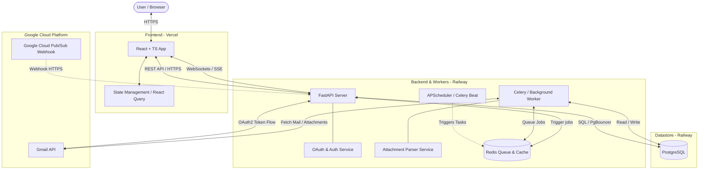
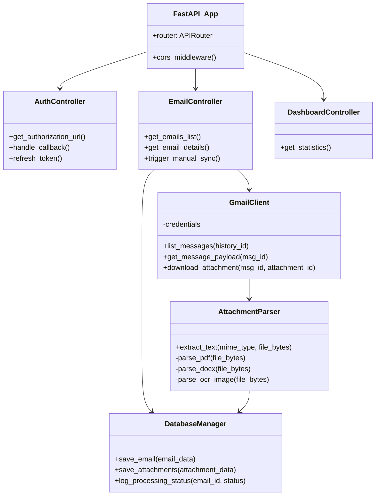
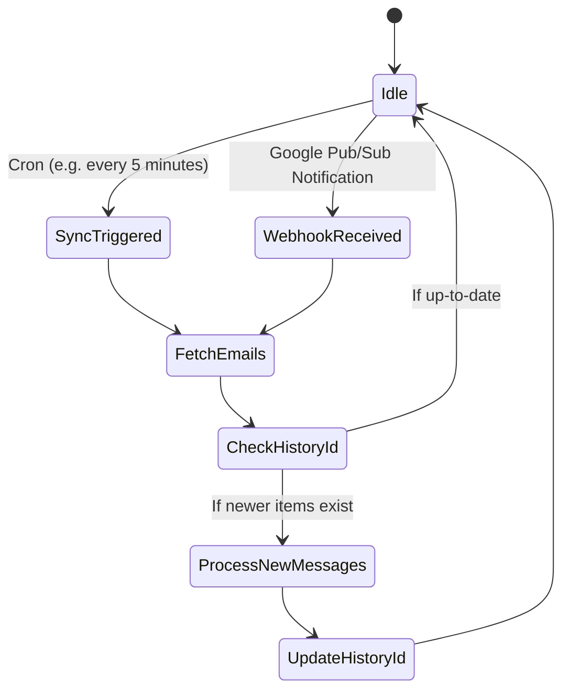
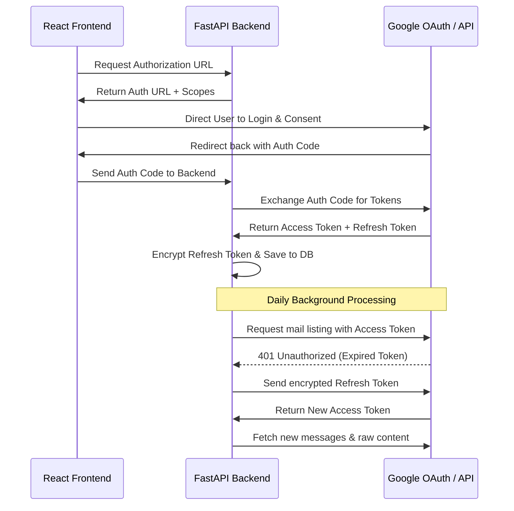
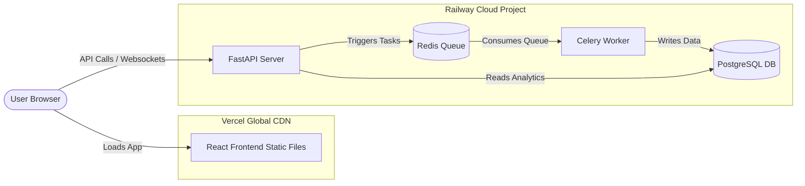

# Email Processing Dashboard Architecture Document

This document outlines the software architecture, database design, API specifications, and deployment strategies for the **Email Processing Dashboard**. It is designed to be highly scalable, maintainable, and robust.

---

## 1. High-Level Architecture

The Email Processing Dashboard follows a modern, decoupled **Single Page Application (SPA)** and **RESTful API** pattern, augmented by an **Event-Driven / Queue-based** worker system for processing heavy tasks (like email fetching, OCR, and attachment extraction) asynchronously.

### System Architecture Diagram


### Communication Flow
1. **Dashboard Access**: The user accesses the React UI via HTTPS hosted on Vercel.
2. **Authentication**: The dashboard initiates a Google OAuth2 flow through the FastAPI Backend to authorize access to the user's Gmail box. The backend stores the credentials securely.
3. **Email Event Stream**: 
   - *Push Method*: Google Pub/Sub fires a webhook to FastAPI when a new email is received.
   - *Poll Method (Fallback)*: A background scheduler triggers a worker task to query the Gmail API for new messages using history IDs.
4. **Task Processing**:
   - The FastAPI backend pushes a `process_email` task into the Redis queue.
   - A background Celery worker picks up the task, calls the Gmail API to retrieve the email body and any attachments, extracts text from files, and writes everything into PostgreSQL.
5. **Dashboard Updates**: The frontend fetches data via REST API. Real-time notifications of newly processed emails can be sent to the frontend using Server-Sent Events (SSE) or WebSockets.

---

## 2. Low-Level Architecture

The system is decomposed into highly cohesive, loosely coupled services:



- **Authentication Module**: Manages the secure storage and rotation of Gmail OAuth tokens.
- **Gmail Worker Client**: Connects via Google API client library, parses MIME messages, downloads raw attachments safely, and handles rate limiting.
- **Attachment Parser Service**: A pipeline containing libraries like `PyPDF2`/`pdfplumber` (for PDF text), `python-docx` (for Word documents), and `Tesseract-OCR` or `easyocr` (for image file text extraction).
- **Database Engine (SQLAlchemy/SQLModel)**: Handles pooling, transactions, and migration states via Alembic.

---

## 3. Component Diagram

The following diagram defines the boundaries, structural components, and interfaces of the application:

```mermaid
component {
  [React Frontend] as UI
  [FastAPI Gateway] as Gateway
  [Auth Manager] as Auth
  [Scheduler Daemon] as Sched
  [Redis Broker] as Broker
  [Task Worker] as Worker
  [Attachment Extractor] as Extractor
  [PostgreSQL DB] as DB
  [Gmail Service] as Gmail
}

UI --> Gateway : "REST Calls (HTTPS) / Auth Tokens"
Gateway --> Auth : "Verify User Access"
Gateway --> DB : "Fetch dashboard data"
Gateway --> Broker : "Enqueue manually triggered syncs"
Sched --> Broker : "Enqueue periodic fetch tasks"
Broker --> Worker : "Distribute tasks"
Worker --> Gmail : "Request email detail & raw attachment files"
Worker --> Extractor : "Pass files for parsing"
Worker --> DB : "Store parsed email, text content, and logs"
```

---

## 4. Folder Structure

The project will structure code in a monorepo format, separating concerns clearly between frontend, backend, and database migrations.

```
/email-processor-workspace
│
├── /backend                    # FastAPI Backend Application
│   ├── /app
│   │   ├── __init__.py
│   │   ├── main.py             # FastAPI entry point
│   │   ├── config.py           # Settings and Environment variables
│   │   ├── /api                # API Route handlers
│   │   │   ├── __init__.py
│   │   │   ├── auth.py         # OAuth2 / Gmail Auth routes
│   │   │   ├── emails.py       # Email management routes
│   │   │   └── dashboard.py    # Analytics/statistics routes
│   │   │
│   │   ├── /core               # Core shared logic (security, database sessions)
│   │   │   ├── db.py           # Database connection & session setup
│   │   │   └── security.py     # Encryption for OAuth refresh tokens
│   │   │
│   │   ├── /models             # SQLAlchemy Database Models
│   │   │   ├── email.py
│   │   │   ├── attachment.py
│   │   │   └── credentials.py
│   │   │
│   │   ├── /schemas            # Pydantic Schemas (Request/Response validation)
│   │   │   ├── email.py
│   │   │   ├── attachment.py
│   │   │   └── dashboard.py
│   │   │
│   │   ├── /services           # Business logic services
│   │   │   ├── gmail_service.py # Gmail integration wrapper
│   │   │   ├── parser_service.py# PDF/Docx/Image attachment text extractor
│   │   │   └── crypto_service.py# Encryption helper
│   │   │
│   │   └── /workers            # Celery / Background Task handlers
│   │       ├── celery_app.py
│   │       └── tasks.py        # Background task definitions (fetch, process)
│   │
│   ├── alembic/                # Database migrations
│   ├── requirements.txt        # Backend dependencies
│   ├── Dockerfile              # Backend production Docker configuration
│   └── tests/                  # Backend unit & integration tests
│
├── /frontend                   # React TypeScript Frontend Application
│   ├── /public
│   ├── /src
│   │   ├── /assets             # Icons, images, style tokens
│   │   ├── /components         # Reusable UI elements (Buttons, Tables, Modals)
│   │   │   ├── EmailList.tsx
│   │   │   ├── AttachmentViewer.tsx
│   │   │   └── DashboardStats.tsx
│   │   ├── /context            # Theme & Authentication contexts
│   │   ├── /hooks              # Custom hooks (e.g. useEmails, useStats)
│   │   ├── /layouts            # Common page structures
│   │   ├── /pages              # Dashboard pages
│   │   │   ├── Dashboard.tsx
│   │   │   ├── Emails.tsx
│   │   │   └── Settings.tsx
│   │   ├── /services           # API query integrations (Axios/React Query)
│   │   │   └── api.ts
│   │   ├── /types              # TypeScript type interfaces
│   │   │   └── index.ts
│   │   ├── /utils              # Date formatting, helpers
│   │   ├── App.tsx             # Main App Router & Config
│   │   ├── main.tsx
│   │   └── index.css           # Custom CSS styling configuration
│   │
│   ├── package.json
│   ├── tsconfig.json           # TS Configuration
│   ├── vite.config.ts          # Vite build config
│   └── tailwind.config.js      # Styling framework config (if Tailwind is used)
│
└── README.md
```

---

## 5. Database Schema

We will use a relational database (PostgreSQL) to store structured email data, dynamic/rich content metadata, and attachment parsing details.

### ER Diagram Description
- **`gmail_credentials`**: Stores OAuth2 tokens per application user. The refresh token is encrypted symmetrically.
- **`emails`**: Primary email metadata. Has a 1-to-many relationship with `attachments` and `processing_logs`.
- **`attachments`**: Tracks file details, processing status, and houses the extracted plain text.
- **`processing_logs`**: Tracks step-by-step processing failures or success events for auditability.

```mermaid
erDiagram
    GMAIL_CREDENTIALS {
        uuid id PK
        string email UNIQUE
        text access_token
        text refresh_token
        timestamp expires_at
        timestamp updated_at
    }

    EMAILS {
        uuid id PK
        string message_id UNIQUE "Gmail message identifier"
        string subject
        string sender
        string recipient
        timestamp received_at
        text body_plain
        text body_html
        string processing_status "pending | processed | failed"
        timestamp created_at
    }

    ATTACHMENTS {
        uuid id PK
        uuid email_id FK "References EMAILS(id)"
        string attachment_id "Gmail attachment API ID"
        string filename
        string mime_type
        integer file_size_bytes
        text extracted_text "Extracted OCR or text file data"
        string file_path_s3 "Remote path if raw file is archived"
        string processing_status "pending | processing | completed | failed"
        text error_message
        timestamp created_at
    }

    PROCESSING_LOGS {
        uuid id PK
        uuid email_id FK "References EMAILS(id)"
        string stage "fetch | parse | db_write"
        string log_level "info | warning | error"
        text message
        timestamp created_at
    }

    EMAILS ||--o{ ATTACHMENTS : "contains"
    EMAILS ||--o{ PROCESSING_LOGS : "logs events for"
```

---

## 6. API Design

### Endpoints Specification

#### 1. OAuth / Gmail Setup
* **`GET /api/v1/auth/google/url`**
  - **Purpose**: Generates the Google OAuth Consent Screen URI for authentication.
  - **Response**: `{ "url": "https://accounts.google.com/o/oauth2/..." }`
* **`GET /api/v1/auth/google/callback`**
  - **Purpose**: Google OAuth redirect destination. Extracts authorization code, requests tokens, and stores them.
  - **Query Params**: `code`, `state`
  - **Response**: Redirects client to Dashboard or responds with authentication token.

#### 2. Email Management
* **`GET /api/v1/emails`**
  - **Purpose**: Retrieve paginated list of processed emails.
  - **Query Params**: `page`, `page_size`, `status` (filter), `search` (full-text search against subject/sender/body/extracted text).
  - **Response**:
    ```json
    {
      "items": [
        {
          "id": "e44c-47bc...",
          "subject": "Invoice June 2026",
          "sender": "billing@domain.com",
          "received_at": "2026-06-03T12:00:00Z",
          "processing_status": "processed",
          "attachment_count": 1
        }
      ],
      "total": 45,
      "page": 1,
      "pages": 5
    }
    ```
* **`GET /api/v1/emails/{id}`**
  - **Purpose**: Retrieve detailed information about a specific email and its attachments.
  - **Response**: Contains subject, body, list of attachments, and processing logs.
* **`POST /api/v1/emails/sync`**
  - **Purpose**: Manually force trigger the backend to fetch new emails from Gmail API.
  - **Response**: `{ "status": "job_enqueued", "task_id": "job_12345" }`

#### 3. Attachments
* **`GET /api/v1/attachments/{id}/extracted`**
  - **Purpose**: Returns the extracted text of a document/image attachment.
  - **Response**: `{ "attachment_id": "...", "extracted_text": "INVOICE #99812...\nTotal: $1,250..." }`

#### 4. Dashboard Stats / Analytics
* **`GET /api/v1/dashboard/metrics`**
  - **Purpose**: Retrieve aggregated values for UI charts and stat cards.
  - **Response**:
    ```json
    {
      "total_emails_processed": 1050,
      "failed_emails": 12,
      "success_rate_percentage": 98.8,
      "processing_by_mime": {
        "application/pdf": 850,
        "application/vnd.openxmlformats-officedocument": 150,
        "image/png": 50
      },
      "timeline": [
        { "date": "2026-06-01", "processed": 12, "failed": 0 },
        { "date": "2026-06-02", "processed": 25, "failed": 1 }
      ]
    }
    ```

---

## 7. Scheduler Strategy

The email detection needs to run automatically in the background. We design a hybrid strategy prioritizing real-time processing and structural fallback.



### Recommendation Strategy
1. **Gmail Pub/Sub (Real-time Primary)**:
   - Configure Gmail API **Watch** feature. This links the Gmail inbox to a Google Cloud Pub/Sub Topic.
   - Google pushes an HTTP POST webhook containing the email state change to our FastAPI deployment on Railway `/api/v1/emails/webhook`.
   - The endpoint receives the notification, verifies the payload, and spins up a worker thread to parse the latest messages.
2. **Periodic Polling via Celery Beat / APScheduler (Fallback)**:
   - Run a scheduler task every **5 to 10 minutes** to query Gmail’s `users.messages.list` interface.
   - This ensures that if the Webhook subscription expires (Google watch registration expires every 7 days) or a network request fails, the system auto-heals and fetches missed emails.
   - Minimizes API overhead by querying messages with a `q` parameter specifying `after:[timestamp_of_last_sync]`.

---

## 8. Gmail Integration Strategy

Integrations with Gmail API require strict adherence to Google security protocols and token lifecycle limits:



### Integration Workflow
- **OAuth Setup**: Enable the `Gmail API` in the Google Cloud Console. Set up credentials with the scope: `https://www.googleapis.com/auth/gmail.readonly`.
- **Token Storage**:
  - `access_token`: Stored in DB with expiry time check. Used for direct REST clients.
  - `refresh_token`: Google only issues this once during initial user consent. The backend encrypts it using AES-256 (via the Python `cryptography` library) before saving it to PostgreSQL.
- **Handling Rate Limits**:
  - Gmail API enforces per-user rate quotas (e.g., 250 quota units per second).
  - The worker uses **exponential backoff** when fetching messages.
  - Instead of downloading full payload objects during lists, the backend grabs list IDs, evaluates duplicates against PostgreSQL, and fetches detailed payloads *only* for missing IDs.
- **Incremental Sync**:
  - Save the Gmail mailbox `historyId` in our database.
  - Use `history.list` API endpoint instead of scanning all messages, retrieving only changed events since the last parsed execution state.

---

## 9. Deployment Architecture

Deploying to Railway and Vercel decouples client-side static rendering from backend server runtimes.



### Infrastructure Specifications

1. **Frontend (Vercel)**
   - Deployed from code repository via automated GitHub Action integration.
   - Built to optimized static builds using Vite.
   - Configured custom rewrite routes via `vercel.json` to route `/api/*` proxies cleanly to the FastAPI backend, bypassing CORS constraints.

2. **Backend Services (Railway)**
   - **Service 1: FastAPI API Gateway**:
     - Auto-scaled container deployment.
     - Runs ASGI server `uvicorn` using `gunicorn` workers for process management.
   - **Service 2: Worker Daemon**:
     - Deployed as a secondary worker instance within the same Railway project to enable private networking.
     - Runs the command: `celery -A app.workers.celery_app worker --loglevel=info`.
   - **Service 3: PostgreSQL Database Add-on**:
     - Managed PostgreSQL instance. Railway supports auto-backups and scaling.
   - **Service 4: Redis Engine Add-on**:
     - Internal memory broker for task management. Secured and isolated from the public web.

3. **Environment Configurations**
   - **FastAPI Core**:
     - `DATABASE_URL` (PostgreSQL connection string)
     - `REDIS_URL` (Redis connection string)
     - `ENCRYPTION_KEY` (AES-256 key for OAuth token storage)
     - `GOOGLE_CLIENT_ID` / `GOOGLE_CLIENT_SECRET` (For Gmail OAuth validation)
     - `GOOGLE_PUB_SUB_VERIFICATION_TOKEN` (To validate webhook authenticity)
   - **React Dashboard**:
     - `VITE_API_BASE_URL` (Points to backend Railway URL)

---

## 10. Technology Justification

This stack is selected to optimize processing speed, code safety, developer productivity, and platform stability.

### Technology Stack Table

| Component | Technology | Primary Alternative | Justification |
| :--- | :--- | :--- | :--- |
| **Backend Framework** | **FastAPI** | Express (Node.js) / Django (Python) | High performance via ASGI asynchronous engine (`async/await`). Native Pydantic validation ensures strict schema verification. Automatically generates interactive OpenAPI documentation (`/docs`) out of the box, saving frontend integration time. |
| **Frontend Framework** | **React + TypeScript** | Vue.js / Vanilla JS | Component-driven model is perfect for data dashboards. TypeScript offers strict typing for API responses, catching schema errors during compile time rather than execution. |
| **Database** | **PostgreSQL** | MongoDB | Highly relational data model (Emails are associated with Attachments and Logs). Strict constraints prevent orphan attachments. Robust support for **JSONB** allows storage of unstructured raw email header objects while remaining queryable. |
| **Queue / Broker** | **Redis + Celery** | RabbitMQ / Cron Jobs | Standard asynchronous pattern in Python. Redis is lightweight and easy to spin up. Celery handles retries, scheduling fallback, and task-serialization natively. |
| **Backend Platform** | **Railway** | AWS EC2 / Heroku | Simplifies DevOps. Can run PostgreSQL, Redis, FastAPI, and Celery in a unified logical project boundary with private networking. Auto-builds container images from Git updates. |
| **Frontend Platform** | **Vercel** | Netlify / AWS S3 | Optimized specifically for React SPA deployments. Global CDN edge distribution results in minimal load latency. Serverless edge route configurations simplify backend API proxying. |
