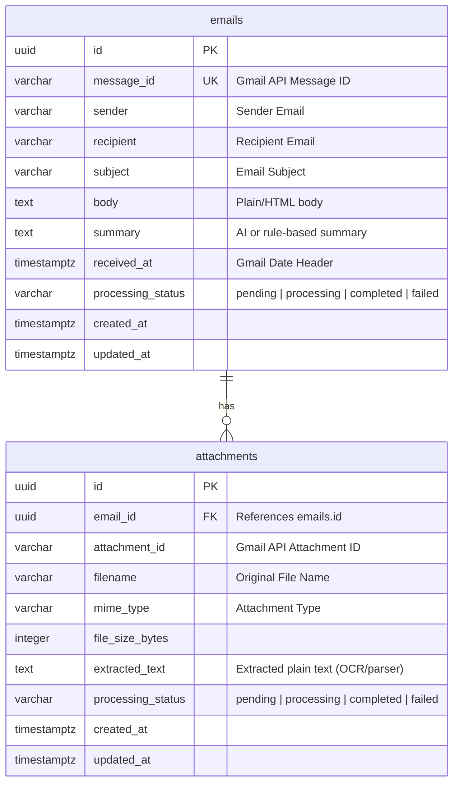

# Email Processing Dashboard: PostgreSQL Database Design

This document details the schema design, relationships, indexing strategies, raw DDL, and SQLAlchemy models for the Email Processing Dashboard.

---

## 1. ER Diagram



---

## 2. Table Specifications

### A. Table: `emails`
Stores metadata and main text payload of incoming emails.

| Column | Type | Constraints | Description |
| :--- | :--- | :--- | :--- |
| `id` | `UUID` | `PRIMARY KEY`, Default: `gen_random_uuid()` | Unique internal identifier. |
| `message_id` | `VARCHAR(255)` | `UNIQUE`, `NOT NULL` | External unique ID from Gmail API to guarantee idempotency. |
| `sender` | `VARCHAR(320)` | `NOT NULL` | Email address of the sender. |
| `recipient` | `VARCHAR(320)` | `NOT NULL` | Destination email address. |
| `subject` | `VARCHAR(998)` | `NOT NULL` | Subject line (trimmed to RFC 2822 max length). |
| `body` | `TEXT` | `NOT NULL` | Full content of the email (plain text or parsed HTML). |
| `summary` | `TEXT` | `NULL` | Optional generated summary of email. |
| `received_at` | `TIMESTAMP WITH TIME ZONE` | `NOT NULL` | Email timestamp from metadata headers. |
| `processing_status` | `VARCHAR(50)` | `NOT NULL`, Default: `'pending'` | Lifecycle state: `'pending'`, `'processing'`, `'completed'`, `'failed'`. |
| `created_at` | `TIMESTAMP WITH TIME ZONE` | `NOT NULL`, Default: `CURRENT_TIMESTAMP` | Database record creation timestamp. |
| `updated_at` | `TIMESTAMP WITH TIME ZONE` | `NOT NULL`, Default: `CURRENT_TIMESTAMP` | Last modified timestamp. |

### B. Table: `attachments`
Stores attachments associated with emails, including extraction status and parsed text content.

| Column | Type | Constraints | Description |
| :--- | :--- | :--- | :--- |
| `id` | `UUID` | `PRIMARY KEY`, Default: `gen_random_uuid()` | Unique internal identifier. |
| `email_id` | `UUID` | `FOREIGN KEY` -> `emails(id)`, `NOT NULL` | Parent email record reference. Cascade delete enabled. |
| `attachment_id` | `VARCHAR(255)` | `NOT NULL` | External ID defined by the Gmail service. |
| `filename` | `VARCHAR(255)` | `NOT NULL` | Name of the attachment file. |
| `mime_type` | `VARCHAR(100)` | `NOT NULL` | File type/format (e.g. `'application/pdf'`). |
| `file_size_bytes` | `INTEGER` | `NOT NULL` | Size of raw file in bytes. |
| `extracted_text` | `TEXT` | `NULL` | Parsed text content output from OCR or file parsers. |
| `processing_status` | `VARCHAR(50)` | `NOT NULL`, Default: `'pending'` | Extraction state: `'pending'`, `'processing'`, `'completed'`, `'failed'`. |
| `created_at` | `TIMESTAMP WITH TIME ZONE` | `NOT NULL`, Default: `CURRENT_TIMESTAMP` | Database record creation timestamp. |
| `updated_at` | `TIMESTAMP WITH TIME ZONE` | `NOT NULL`, Default: `CURRENT_TIMESTAMP` | Last modified timestamp. |

---

## 3. Relationships

- **One-to-Many**: One `emails` record can own zero or more `attachments`.
- **Cascade Rule**: Deleting an email record triggers a cascading delete of all corresponding attachments.
- **Idempotency Safeguard**: The `message_id` constraint ensures that duplicate pulls from Gmail API do not duplicate transactional database rows.

---

## 4. Index Recommendations

To support fast dashboard rendering, search operations, and status filtering:

1. **`idx_emails_received_at`**: B-Tree index on `emails(received_at DESC)`. Accelerates timeline queries and sorting in the main dashboard view.
2. **`idx_emails_processing_status`**: B-Tree index on `emails(processing_status)`. Speeds up worker queries when polling for unprocessed or failed emails.
3. **`idx_emails_sender`**: B-Tree index on `emails(sender)`. Speeds up filtering emails by a specific sender.
4. **`idx_attachments_email_id`**: B-Tree index on `attachments(email_id)`. Optimizes joins when fetching emails alongside their attachment metadata.
5. **Full-Text Search Index (Optional but Recommended)**: A GIN index on a generated tsvector combining `subject`, `body`, and attachment `extracted_text` for rich keyword searching.

---

## 5. PostgreSQL DDL

The database script to setup schema structures, automated index creations, and update triggers:

```sql
-- Enable UUID extension
CREATE EXTENSION IF NOT EXISTS "uuid-ossp";

-- Define custom enum-like checks for processing status
CREATE TABLE emails (
    id UUID PRIMARY KEY DEFAULT gen_random_uuid(),
    message_id VARCHAR(255) NOT NULL UNIQUE,
    sender VARCHAR(320) NOT NULL,
    recipient VARCHAR(320) NOT NULL,
    subject VARCHAR(998) NOT NULL,
    body TEXT NOT NULL,
    summary TEXT,
    received_at TIMESTAMP WITH TIME ZONE NOT NULL,
    processing_status VARCHAR(50) NOT NULL DEFAULT 'pending',
    created_at TIMESTAMP WITH TIME ZONE NOT NULL DEFAULT CURRENT_TIMESTAMP,
    updated_at TIMESTAMP WITH TIME ZONE NOT NULL DEFAULT CURRENT_TIMESTAMP,
    CONSTRAINT chk_email_status CHECK (processing_status IN ('pending', 'processing', 'completed', 'failed'))
);

CREATE TABLE attachments (
    id UUID PRIMARY KEY DEFAULT gen_random_uuid(),
    email_id UUID NOT NULL,
    attachment_id VARCHAR(255) NOT NULL,
    filename VARCHAR(255) NOT NULL,
    mime_type VARCHAR(100) NOT NULL,
    file_size_bytes INTEGER NOT NULL,
    extracted_text TEXT,
    processing_status VARCHAR(50) NOT NULL DEFAULT 'pending',
    created_at TIMESTAMP WITH TIME ZONE NOT NULL DEFAULT CURRENT_TIMESTAMP,
    updated_at TIMESTAMP WITH TIME ZONE NOT NULL DEFAULT CURRENT_TIMESTAMP,
    CONSTRAINT fk_email FOREIGN KEY (email_id) REFERENCES emails(id) ON DELETE CASCADE,
    CONSTRAINT chk_attachment_status CHECK (processing_status IN ('pending', 'processing', 'completed', 'failed'))
);

-- Indices
CREATE INDEX idx_emails_received_at ON emails (received_at DESC);
CREATE INDEX idx_emails_processing_status ON emails (processing_status);
CREATE INDEX idx_emails_sender ON emails (sender);
CREATE INDEX idx_attachments_email_id ON attachments (email_id);

-- GIN Full-Text Index across Subject and Email Body
CREATE INDEX idx_emails_fts ON emails USING gin(to_tsvector('english', subject || ' ' || body));

-- Trigger to automate updated_at fields
CREATE OR REPLACE FUNCTION update_modified_column()
RETURNS TRIGGER AS $$
BEGIN
    NEW.updated_at = now();
    RETURN NEW;
END;
$$ language 'plpgsql';

CREATE TRIGGER update_emails_modtime 
    BEFORE UPDATE ON emails 
    FOR EACH ROW 
    EXECUTE FUNCTION update_modified_column();

CREATE TRIGGER update_attachments_modtime 
    BEFORE UPDATE ON attachments 
    FOR EACH ROW 
    EXECUTE FUNCTION update_modified_column();
```

---

## 6. SQLAlchemy Models

Declarative models matching **SQLAlchemy 2.0** specifications:

```python
import uuid
from datetime import datetime
from typing import List, Optional
from sqlalchemy import String, Text, ForeignKey, DateTime, Integer, func
from sqlalchemy.orm import DeclarativeBase, Mapped, mapped_column, relationship


class Base(DeclarativeBase):
    pass


class EmailModel(Base):
    """
    SQLAlchemy model representing the emails table.
    """
    __tablename__ = "emails"

    id: Mapped[uuid.UUID] = mapped_column(
        primary_key=True, 
        default=uuid.uuid4
    )
    message_id: Mapped[str] = mapped_column(
        String(255), 
        unique=True, 
        nullable=False, 
        index=True
    )
    sender: Mapped[str] = mapped_column(
        String(320), 
        nullable=False, 
        index=True
    )
    recipient: Mapped[str] = mapped_column(
        String(320), 
        nullable=False
    )
    subject: Mapped[str] = mapped_column(
        String(998), 
        nullable=False
    )
    body: Mapped[str] = mapped_column(
        Text, 
        nullable=False
    )
    summary: Mapped[Optional[str]] = mapped_column(
        Text, 
        nullable=True
    )
    received_at: Mapped[datetime] = mapped_column(
        DateTime(timezone=True), 
        nullable=False, 
        index=True
    )
    processing_status: Mapped[str] = mapped_column(
        String(50), 
        default="pending", 
        nullable=False, 
        index=True
    )
    created_at: Mapped[datetime] = mapped_column(
        DateTime(timezone=True), 
        server_default=func.now(), 
        nullable=False
    )
    updated_at: Mapped[datetime] = mapped_column(
        DateTime(timezone=True), 
        server_default=func.now(), 
        onupdate=func.now(), 
        nullable=False
    )

    # Relationships
    attachments: Mapped[List["AttachmentModel"]] = relationship(
        back_populates="email", 
        cascade="all, delete-orphan"
    )

    def __repr__(self) -> str:
        return f"<Email(id={self.id}, message_id='{self.message_id}', sender='{self.sender}', status='{self.processing_status}')>"


class AttachmentModel(Base):
    """
    SQLAlchemy model representing the attachments table.
    """
    __tablename__ = "attachments"

    id: Mapped[uuid.UUID] = mapped_column(
        primary_key=True, 
        default=uuid.uuid4
    )
    email_id: Mapped[uuid.UUID] = mapped_column(
        ForeignKey("emails.id", ondelete="CASCADE"), 
        nullable=False, 
        index=True
    )
    attachment_id: Mapped[str] = mapped_column(
        String(255), 
        nullable=False
    )
    filename: Mapped[str] = mapped_column(
        String(255), 
        nullable=False
    )
    mime_type: Mapped[str] = mapped_column(
        String(100), 
        nullable=False
    )
    file_size_bytes: Mapped[int] = mapped_column(
        Integer, 
        nullable=False
    )
    extracted_text: Mapped[Optional[str]] = mapped_column(
        Text, 
        nullable=True
    )
    processing_status: Mapped[str] = mapped_column(
        String(50), 
        default="pending", 
        nullable=False
    )
    created_at: Mapped[datetime] = mapped_column(
        DateTime(timezone=True), 
        server_default=func.now(), 
        nullable=False
    )
    updated_at: Mapped[datetime] = mapped_column(
        DateTime(timezone=True), 
        server_default=func.now(), 
        onupdate=func.now(), 
        nullable=False
    )

    # Relationships
    email: Mapped["EmailModel"] = relationship(
        back_populates="attachments"
    )

    def __repr__(self) -> str:
        return f"<Attachment(id={self.id}, filename='{self.filename}', mime_type='{self.mime_type}', status='{self.processing_status}')>"
```
