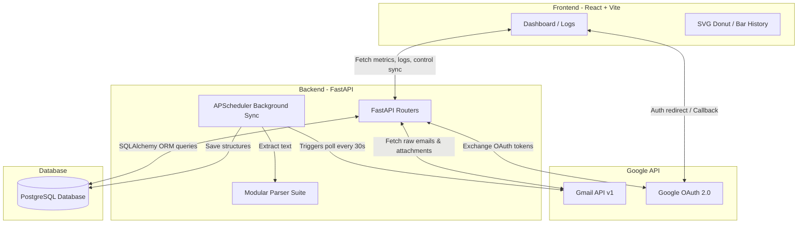
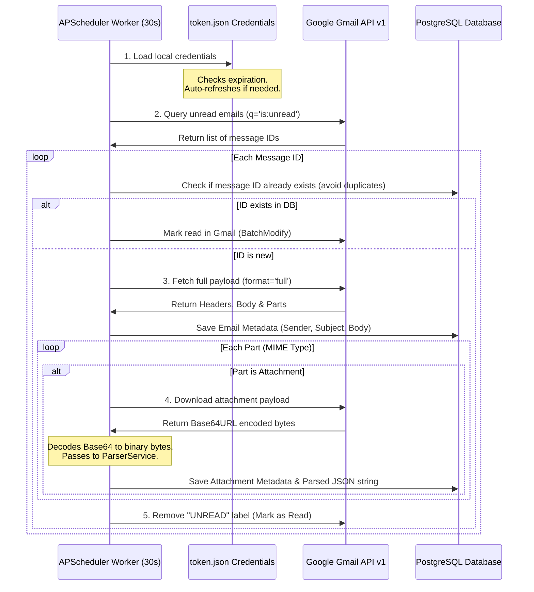

# Project Explanation & Teacher Interview Guide - InboxParser

This guide is designed to help you explain the **InboxParser** project to your teacher, examiner, or interviewer. It covers the architecture, technology choices, parsing logic, security model, and answers to the most common questions you might be asked.

---

## 1. Project Pitch (Short & Impressive Introduction)
> "Sir, **InboxParser** is an automated, secure Email Sync & Document Parsing system. It connects directly with Gmail via OAuth 2.0, polls the inbox every 30 seconds using background workers, downloads attachments (PDF, DOCX, TXT), parses their unstructured text, extracts critical business fields (like invoice numbers, amounts, emails, and custom key-values) using regex patterns, saves the structured output in a PostgreSQL database, and visualizes it on a premium dark glassmorphic React dashboard in real-time."

---

## 2. System Architecture & Flow
The project is built on a decoupled backend-frontend architecture:



---

## 3. Technology Stack & Justifications (Why did you choose X?)

| Technology | Role | Why we chose it (The Technical Reason) |
| :--- | :--- | :--- |
| **FastAPI** (Python) | Backend Framework | Extremely fast (based on Starlette/Uvicorn), supports asynchronous operations natively, automatic OpenAPI (Swagger) generation for `/docs`, and handles JSON payloads with zero parsing overhead. |
| **React + Vite** | Frontend UI | Component-based, lightning-fast HMR (Hot Module Replacement) during development, highly responsive DOM manipulation for real-time graphs and countdowns. |
| **PostgreSQL** | Relational Database | Enterprise-grade, ACID-compliant, natively handles cascading data relationships (Emails -> Attachments), and is scalable for storing millions of rows of email metadata. |
| **APScheduler** | Background Scheduler | Let us run time-based intervals (every 30 seconds) in a background thread of the main python process without requiring complex separate setups like Celery/Redis. |
| **pdfplumber** | PDF Parsing Library | Unlike `PyPDF2` (which only reads raw characters), `pdfplumber` preserves visual layout, tables, and spacing, allowing more accurate extraction of structures. |

---

## 4. Gmail API Connection & Inbox Control (Detailed Breakdown)

To connect and fetch data from Gmail without violating user security boundaries, we implement the following flow in **`gmail_service.py`**:



### **Code-Level Details (How the API is controlled in python):**

* **Credentials Loading & Refreshing**:
  ```python
  creds = Credentials.from_authorized_user_file('token.json', SCOPES)
  if creds.expired and creds.refresh_token:
      creds.refresh(Request())
  ```
* **Building the API client**:
  ```python
  service = build('gmail', 'v1', credentials=creds)
  ```
* **Fetching only Unread messages**:
  We query the message list with the search query `q='is:unread'`. This filters out read emails immediately on Google's servers.
  ```python
  results = service.users().messages().list(userId='me', q='is:unread').execute()
  messages = results.get('messages', [])
  ```
* **Downloading Attachment Files**:
  Gmail returns attachment data inside MIME parts as a unique `attachmentId`. We fetch the raw binary using this ID:
  ```python
  att_res = service.users().messages().attachments().get(
      userId='me', messageId=msg_id, id=attachment_id
  ).execute()
  raw_data = att_res.get('data', '')
  file_bytes = base64.urlsafe_b64decode(raw_data.encode('UTF-8'))
  ```
* **Marking Mails as Read (BatchModify)**:
  Once parsed successfully, we tell Google to remove the `UNREAD` label, making sure we don't process it again in the next 30-second cycle.
  ```python
  service.users().messages().batchModify(
      userId='me',
      body={'ids': [msg_id], 'removeLabelIds': ['UNREAD']}
  ).execute()
  ```

---

## 5. Attachment Parsing Suite & Extraction Logic (How it works & Why)

When a binary payload (bytes) is passed to `ParserService.extract_text`, it resolves the parser type using a **Factory Pattern** based on MIME-type or file extension.

### **1. PDF Parsing (`pdfplumber`)**
* **Why it was used**: Standard libraries like `PyPDF2` or `pypdf` only read raw text segments. If a PDF has columns or a table layout (like an invoice), they merge text horizontally, scrambling layout contents. `pdfplumber` preserves visual coordinate structures and table lines, keeping texts in clean, natural reading rows.
* **Code Logic**:
  ```python
  with pdfplumber.open(io.BytesIO(file_bytes)) as pdf:
      for i, page in enumerate(pdf.pages):
          page_text = page.extract_text()
  ```
* **Verification Check**: Before opening, we verify that the first few bytes contain the magic PDF header signature `b'%PDF'` to catch corrupted files immediately.

### **2. DOCX Parsing (Native XML / ElementTree)**
* **Why it was used**: We wanted to avoid heavy external libraries (like `python-docx` which relies on native OS-compiled elements and can cause deployment issues). A `.docx` file is technically a **ZIP archive** containing XML configurations.
* **Code Logic**: We read the main word document file `word/document.xml` using Python's native `xml.etree.ElementTree` parser to loop through paragraphs (`<w:p>`) and run elements (`<w:t>`).
  ```python
  with zipfile.ZipFile(io.BytesIO(file_bytes)) as docx:
      xml_content = docx.read('word/document.xml')
      root = ET.fromstring(xml_content)
  ```

### **3. Plain Text Parsing (`txt_parser.py`)**
* **Why it was used**: Text files can use different character encodings depending on the operating system (Windows uses `cp1252/latin-1`, macOS/Linux use `utf-8`). Using only `utf-8` would crash the server on standard Windows-encoded text files.
* **Code Logic**: We try decoding using `utf-8`. If it raises a `UnicodeDecodeError`, we fall back to `latin-1` (which never raises decoding exceptions). We also search for binary null-bytes (`\x00`) to catch binary files renamed to `.txt` by mistake.

### **4. Key-Value & Advanced Extraction Heuristics (`utils.py`)**
Once raw text is extracted, it is normalized and passed to `structure_to_json()`:
1. **Global Email Address Harvesting**: Standard global regex search:
   ```python
   re.findall(r'[a-zA-Z0-9._%+-]+@[a-zA-Z0-9.-]+\.[a-zA-Z]{2,}', text)
   ```
2. **Global Date Recognition**: Targets YYYY-MM-DD, DD-MM-YYYY, and DD/MM/YYYY formats.
3. **Generic Key-Values**: Searches for lines matching `Key : Value` pattern (where key < 50 chars):
   ```python
   match = re.match(r'^\s*([A-Za-z0-9\s_-]+)\s*:\s*(.+)$', line)
   ```
4. **Smart Invoice Mapping**: Maps keys containing terms like "invoice number", "bill date", "total due" directly to structured variables.
5. **Multi-Currency Price Fallback**: If no total key is matched, searches raw text globally for the first price format supporting USD ($), INR (₹/Rs./INR), EUR (€), or GBP (£):
   ```regex
   (?:[\$\u20B9\u20AC\u00A3]|Rs\.?|INR)\s*[0-9]{1,3}(?:,[0-9]{3})*(?:\.[0-9]{2})?
   ```
6. **AI Resume & Developer Profiler (New Advanced Rule)**:
   If the file is identified as a resume/CV, the parser runs heuristic miners:
   * **Candidate Name**: Inspects the first 3 non-empty lines using a strict alphabet capitalization match: `^[A-Za-z\s]{3,35}$` (filtering out file headers).
   * **Phone Number**: Extracts global phone formats with 10 to 13 digits.
   * **Social Profiles**: Scans for GitHub and LinkedIn profile links.
   * **Technical Skills Miner**: Scans the text case-insensitively for 30+ developer keywords (Python, React, TypeScript, Docker, FastAPI, AWS, etc.) and injects them as formatted skills.
   * *All mined resume fields are injected directly into `extracted_key_values` so they render automatically in the frontend.*

---

## 6. Compile of Potential Teacher Questions & Answers (Q&A)

### Q1: App background me sync kaise karti hai? Har 30 seconds me sync karne ke liye kya use kiya?
* **Answer**: Sir, humne backend me **`APScheduler` (Advanced Python Scheduler)** use kiya hai. Jab FastAPI server start hota hai, toh startup event hooks (`@app.on_event("startup")`) ke zariye scheduler call hota hai. Ye scheduler main thread se alag ek background thread pool me chalta hai aur **`seconds=30`** interval par `GmailService().sync_emails()` function execute karta hai, jo Gmail API se unread emails fetch karta hai.

### Q2: Gmail login me credentials direct password daalke kyu nahi kiya? OAuth 2.0 kyu use kiya?
* **Answer**: Google kisi bhi third-party app ko direct password input allow nahi karta (security reasons/privacy). Isliye humne **Google OAuth 2.0** protocol use kiya hai. User hamari app ko browser ke zariye Google Consent Screen par allow karta hai. Google hume temporary `Authorization Code` deta hai jise hum access tokens aur refresh tokens me badalte hain. Ye tokens secure `token.json` file me save hote hain.

### Q3: token.json file expire ho jaye toh user ko har baar dubara login karna padega?
* **Answer**: Nahi sir. Hamare auth status endpoint (`/status`) me refresh token handling automatic hai. Google authentication library credentials ki validity check karti hai. Agar token expire ho chuka hai, toh backend background me **`creds.refresh(Request())`** call karke token ko auto-renew kar deta hai bina user ko login page par redirect kiye.

### Q4: OAuth callback API (`/callback`) ka kya role hai?
* **Answer**: Jab user Google standard window par "Allow" par click karta hai, toh Google browser ko redirect karke `/auth/google/callback` API par bhejta hai. Google is request me ek secure security ticket (`code`) bhejta hai. Hamara backend is code ko read karke Google API servers se tokens generate karata hai, use `token.json` me save karta hai, local database wipe karta hai aur page ko React frontend home page par wapis redirect karta hai.

### Q5: Naya user login karne par purane user ka data kaise handle hota hai? Data leak kaise bachaya?
* **Answer**: Sir, humne data privacy aur user separation enforce kiya hai. `/callback` API me jaise hi koi naya token generate hota hai ya `/logout` API call hoti hai, hum backend se `clear_database()` call karte hain. Ye function PostgreSQL tables me email and attachment tables ko permanently wipe kar deta hai (`db.query(EmailModel).delete()`) taaki naye user ko kisi purane user ke email logs na dikhein.

### Q6: Attachment parsing rules kya hain? Aur agar attachment file khali ya corrupted ho toh application crash hogi?
* **Answer**: Humne standard interfaces ke sath ek dynamic parser factory class design ki hai. Custom logic handle karta hai:
  * **PDF Files**: `pdfplumber` engine text contents nikalta hai.
  * **DOCX Files**: Standard ZIP utility XML document (`word/document.xml`) parse karti hai.
  * **TXT Files**: UTF-8 aur Latin-1 fallbacks apply hote hain.
  
  **Crash Prevention**: Agar file khali hai, corrupt zip hai, ya unsupported format hai, toh hamara parser suite custom exceptions raise karta hai (`EmptyFileError`, `CorruptedFileError`, `UnsupportedFormatError`). Ye error backend handle karta hai aur application crash hone ke bajaye error logs status database me write kar deti hai.

### Q7: Text se structured fields (Invoice no, amounts, emails) kaise extract kiye? Kya standard rules hain?
* **Answer**: Humne `utils.py` me regex (regular expressions) engine likha hai. 
  1. Sabse pehle hum pure string text ko line-by-line split karte hain aur lines ko clean/normalize karte hain.
  2. Uske baad key-value patterns (jaise: `Key : Value`) se data dictionary me extract karte hain.
  3. Predefined keywords (jaise `Total`, `Amount Due`, `Invoice Date`, `Invoice Number`) ko query karke generic fields map karte hain.
  4. Global regex patterns ke zariye saare email addresses aur dates (e.g. `YYYY-MM-DD`, `DD/MM/YYYY`) ko clean lists me convert kar dete hain.

### Q8: Client-side parsing kyu rakhi hai frontend me? (App.tsx me parseTextToStructuredData kya hai?)
* **Answer**: Agar database me kuch legacy records hain jinme flat parsed text save hai (aur structured JSON JSON-string nahi hai), toh frontend break na ho. Frontend custom parser automatically fallback check karke client-side par regex chala kar un plain text fields se dynamic invoices, emails aur key-value list extract karke structured view me show kar deta hai.

### Q9: Custom layout and design choices kya hain? CSS framework kyu nahi use kiya?
* **Answer**: Sir, humne maximum UI flexibility aur design details par control paane ke liye **Vanilla CSS** (`index.css`) use kiya hai. App ko modern premium feel dene ke liye humne:
  * **HSL tailored colors** aur dark glassmorphic backgrounds use kiye hain.
  * Card components aur metrics rows par hover animations lagayi hain.
  * Chrome standard scrollbars ko replace karke customized sunset gradient colors aur custom horizontal scrolling layouts use kiye hain.

### Q10: Horizontal overflow hone par text card/layout se bahar kyu nahi jata? Kaise fixed kiya?
* **Answer**: Pehle lamba text block size limit na hone ke karan modal/card bounds ke bahar leak ho raha tha. Isko fix karne ke liye humne inner structured card container par `minWidth: '100%'` aur `width: 'max-content'` style lagayi hai. Isse inner container natural maximum width (longest text length) par expand hota hai, aur iska wrapper (`custom-horizontal-scrollbar` with `overflow-x: auto`) smooth horizontal scrolling trigger kar deta hai bina text clip ya boundary leak kiye.

### Q11: Dashboard me graph libraries (Recharts / Chart.js) kyu nahi lagayi? Custom SVG aur CSS kyu use kiye?
* **Answer**: external dependencies ko minimum rakhne aur application bundle size light rakhne ke liye humne custom SVG aur native CSS elements use kiye hain:
  1. **Processing History Graph**: Ye pure dynamic divs hain jinki height absolute heights ke relative height calculations aur values se direct coordinate scale hoti hai.
  2. **Attachment Distribution Donut Chart**: Ye standard HTML dynamic parameters par dynamic **SVG vector circle** arcs render karta hai. `strokeDasharray` aur `strokeDashoffset` dynamically percentages ko represent karte hain, aur center transparent hone ki wajah se dark background glassmorphic look barkarar rehta hai.

### Q12: Dashboard automatically refresh kaise hota hai? Polling scheduler kaise frontend update karta hai?
* **Answer**: Frontend me humne ek react `useEffect` hooks timer set kiya hai. `nextSyncCountdown` state dynamic ticker chala kar `30` se `0` tak countdown karti hai. Jaise hi timer `0` hota hai, frontend background me API call karke metrics aur logs fetch kar leta hai aur timer ko reset kar deta hai. Isse dashboard hamesha latest database records ke sync me chalta hai bina dashboard crash kiye.

### Q13: Agar main resume PDF upload karu, toh structured data me candidate name, phone number, aur technical skills kaise dikh rahe hain? Kya humne specific AI model lagaya hai?
* **Answer**: Nahi sir, humne bina heavyweight machine learning libraries (jaise Spacy/NLTK) lagaye, **highly optimized heuristics aur rule-based regex algorithms** use kiye hain. Parser pehle document identify karta hai (agar filename ya content me resume/CV terms hon). Uske baad:
  1. **Name**: Pehli teen lines me capitalization words pattern search karta hai (`Candidate Name`).
  2. **Phone**: Standard digits verification scan chalta hai (`Phone Number`).
  3. **Skills**: Predefined tech keywords (Python, React, TypeScript) search karke dynamic list create karta hai (`Skills Extracted`).
  4. **Links**: LinkedIn/GitHub profile URLs locate karta hai.
  In sabhi details ko dynamic key-value pairs banakar `extracted_key_values` me inject kar diya jata hai jise React frontend automatic render kar deta hai.

---

## 7. API Reference Summary (Cheat-Sheet for oral exams)

Keep this table handy during the project demonstration:

| Endpoint | Method | Input Parameters | What it returns (Output) | Action performed |
| :--- | :--- | :--- | :--- | :--- |
| `/api/v1/auth/google/login` | **GET** | None | Redirects to Google Login URL | Begins the user authorization consent page |
| `/api/v1/auth/google/callback`| **GET** | `code`, `state`, `error` | Redirects back to React App | Saves credentials as `token.json`, runs initial Gmail fetch |
| `/api/v1/auth/google/status`  | **GET** | None | `{"authenticated": bool, "email": str, "mode": str}` | Checks login status and refreshes expired tokens |
| `/api/v1/auth/google/logout`  | **POST** | None | `{"status": "success", "message": "..."}` | Deletes `token.json` and wipes email tables from DB |
| `/api/v1/emails`              | **GET** | `page`, `limit`, `search`, `status`, `start_date`, `end_date`, `attachment_type` | `{"items": [...], "total": int, "pages": int}` | Fetches email records list based on filter query criteria |
| `/api/v1/emails/{id}`         | **GET** | `id` (path) | Email details model object | Returns single email message, parsed summary, and all attachments |
| `/api/v1/emails/sync`         | **POST** | None | `{"status": "success", "processed_count": int}` | Manually triggers active user inbox sync |
| `/api/v1/dashboard/metrics`   | **GET** | None | Metrics object with daily timelines | Returns summary calculations for cards and graphs |
